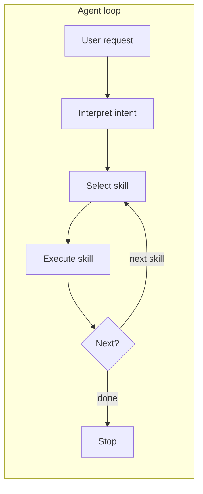
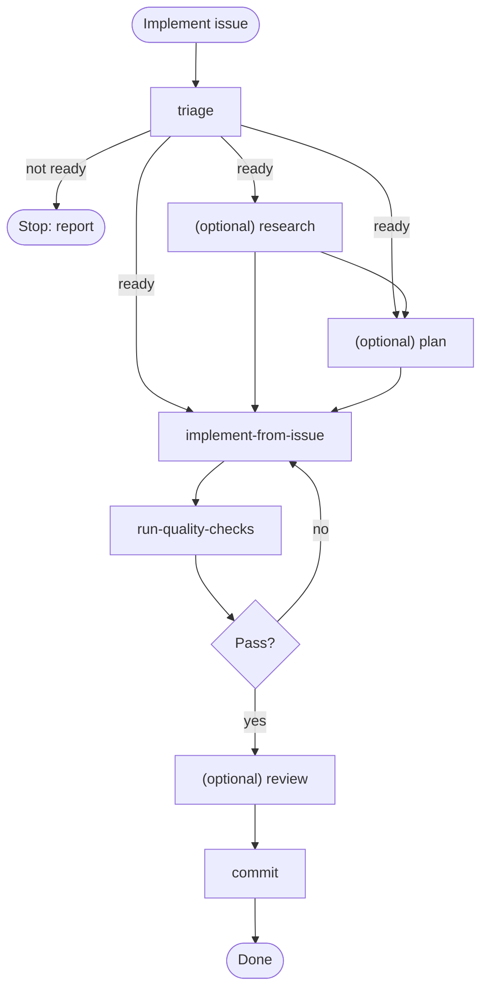
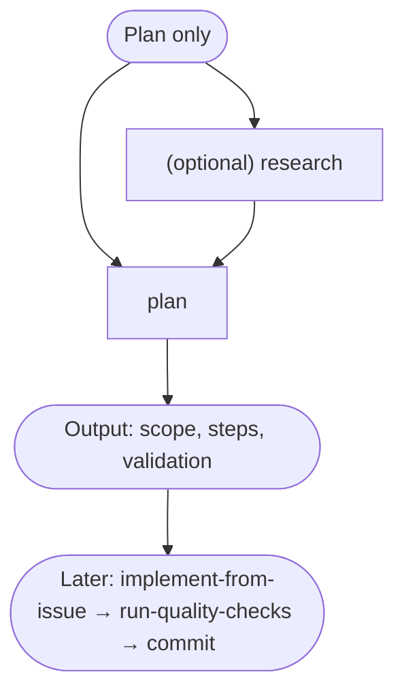

# Agentic workflow

How the Cursor agent chooses and chains skills. **Source of truth:** GitHub issues; skills in `.cursor/skills/`. This project uses a lightweight **Research → Plan → Execute → Validate** loop; the sections below spell it out.

## 1. Agent loop (each turn)

Each turn the agent: interprets the user’s intent, selects a skill (or slash command), runs it, then either runs the next skill the workflow specifies or stops.

- **Select skill**: Match request to a skill (e.g. “implement #5” → implement-from-issue; “run tests” → run-quality-checks). Use the tables below.
- **Execute skill**: Follow that skill’s steps (read issue, edit code, run commands, etc.).
- **Next?**: After the skill, either run the next skill the workflow specifies (see “Skill → next step”) or stop.

## 2. Main flow: issue → implemented → committed

Full path from “implement this issue” to “commit with approval”. Optional steps: triage, research, plan, review.

- **triage**: Classify issue, check completeness; if not ready, stop and report.
- **(optional) research**: Use when the issue or approach depends on external APIs, standards, or current best practices.
- **(optional) plan**: Short plan (scope, steps, validation) before coding; use for non-trivial work.
- **implement-from-issue**: Implement in `src/`, add/update tests; use issue “Reference (Kalvi codebase)” where applicable.
- **run-quality-checks**: pytest, Ruff check/format, optionally Pylint/mypy/pre-commit. If fail, fix and re-run checks.
- **(optional) review**: Review changes vs issue and standards; suggest only.
- **commit**: Propose Conventional Commit message; run `git commit` only after explicit user approval.

## 3. Plan-only flow

When the user wants a plan only (no code yet). Optional research when the plan depends on external or current knowledge.

## 4. When to use which skill (and then what)

| User intent | Skill(s) | Then |
|-------------|----------|------|
| Do issue #N / Implement this | **implement-from-issue** | **run-quality-checks** |
| Break this down / Plan this | **plan** | (later) **implement-from-issue** |
| Which issues are ready? / Triage #N | **triage** | If ready → **research** (optional) or **plan** (optional) or **implement-from-issue**. If not → stop. |
| Review my changes / Review before commit | **review** | done, or **commit** if user wants to commit |
| Run tests / lint / verify green | **run-quality-checks** | done |
| Commit / suggest commit message | **commit** | done (after approval) |
| Something broke / tests failing | **debug** | **run-quality-checks** → done or **commit** |
| Update docs for this change | **docs** | done, or **run-quality-checks** then **commit** if code touched |
| Add tests for X | **test** | **run-quality-checks** → done or **commit** |
| Refactor X (no behavior change) | **refactor** | **run-quality-checks** → done or **commit** |
| Maintain library / keep things up to date | **maintain** | propose commit → **commit** if approved |
| Release / publish to PyPI | **release** | done |
| Upgrade dependency X | **dependency-update** | **run-quality-checks** → propose commit → **commit** if approved |
| How healthy is this project? | **project-review** | done (optional: **maintain** or **run-quality-checks** after) |
| Research X / write research doc | **research** | done |

## 5. Skill → next step

How to chain after each skill.

| Skill | Typical next step |
|-------|--------------------|
| **triage** | If ready → **research** (optional) or **plan** (optional) or **implement-from-issue**. If not ready → stop. |
| **research** | **plan** or **implement-from-issue** (or stop if standalone). |
| **plan** | (Later) **implement-from-issue**. |
| **implement-from-issue** | **run-quality-checks**. |
| **run-quality-checks** | If pass → **review** (optional) or **commit**. If fail → fix (e.g. **debug**) then **run-quality-checks** again. |
| **review** | **commit** if user wants to commit; else stop. |
| **commit** | Stop (commit runs once after approval). |
| **debug** | **run-quality-checks** then stop or **commit**. |
| **test**, **refactor** | **run-quality-checks** then stop or **commit**. |
| **docs** | Done (if docs-only), or **run-quality-checks** then stop or **commit** if code touched. |
| **maintain** | Propose commit → **commit** if user approves. |
| **dependency-update** | **run-quality-checks** → propose commit → **commit** if approved. |
| **release** | Stop. |
| **project-review**, **research**, **bootstrap-from-template** | Stop (or user triggers another flow). |

## 6. Optional research

Use the **research** skill when a step depends on external or up-to-date information:

- **Before plan or implement**: Issue vague, or "best practice" / external API / library — run **research** then **plan** or **implement-from-issue**.
- **project-review**: Consult best practices (research + optional write to `docs/research/`).
- **maintain**: When validating docs/deps against current best practices.
- **dependency-update**: When upgrading a major version (changelog/migration).
- **docs**: When documenting an external API or standard.
- **debug**: When the failure is unknown or version-specific (search error message or library behavior).

Do not require research on every task; only when the workflow or issue clearly needs it.

## 7. Cursor agent mode per skill

Which [Cursor agent mode](https://cursor.com/docs/agent/modes) to use when running each skill. Modes differ by tools and behavior: **Agent** = full tools, autonomous edits; **Ask** = read-only (search only); **Plan** = plan first, then build; **Debug** = hypothesis + instrumentation + runtime analysis.

| Skill | Cursor mode | Why |
|-------|-------------|-----|
| **triage** | Agent (or Ask) | Fetching issues from GitHub (MCP) requires Agent; use Ask only when triaging pasted issue content (read-only classify, check completeness). |
| **plan** | Plan | Produces scope/steps/validation only; Plan mode creates a reviewable plan before any execution. |
| **research** | Agent (or Ask) | Exa/Context7 MCP for search or writing to `docs/research/` requires Agent; use Ask only when researching pasted content or codebase-only (no MCP). |
| **project-review** | Ask (or Agent) | Ask for read-only rubric and assessment; use Agent if "consult best practices" (research MCP) or writing to `docs/research/`. |
| **review** | Ask | Suggest-only; no direct edits, so read-only is appropriate. |
| **implement-from-issue** | Agent | Multi-file edits, tests, commands; full autonomy. |
| **run-quality-checks** | Agent | Runs pytest, Ruff, etc.; needs terminal and possibly fixes. |
| **commit** | Agent | Needs git write; run after explicit approval. |
| **debug** | Debug | Tricky bugs, regressions; use runtime and instrumentation (Cursor Debug mode). |
| **docs** | Agent | Edits docs; full tools. |
| **test** | Agent | Adds/edits tests; multi-file edits and runs. |
| **refactor** | Agent | Code edits across files. |
| **maintain** | Agent | Edits + dependency/docs updates + propose commit. |
| **dependency-update** | Agent | Edits lockfile/deps, runs checks, propose commit. |
| **release** | Agent | Version bump, tag, build, publish; needs terminal and repo writes. |
| **bootstrap-from-template** | Agent | Renames project/package; multi-file edits. |

**Summary:** Use **Ask** for plan (output-only), review, and for research/project-review when no MCP or write is needed; use **Agent** for triage (GitHub MCP), research (Exa/Context7 MCP or write), and project-review when it uses research or writes. Use **Plan** when you want a formal plan before implementing (e.g. “plan this issue”). Use **Agent** for any skill that edits code or runs commands. Use **Debug** for the **debug** skill. Switch with `Cmd+.` / `Ctrl+.` or the mode picker.

## 8. Slash commands

- **`/code-review`**: Run **review** on selected or recent code (suggest only).
- **`/run-quality-checks`**: Run **run-quality-checks** and report pass/fail.

Same skills can be invoked by natural-language request. See [Cursor setup](cursor-setup.md) for more.

## 9. One-line summary

**Issue → triage (optional) → research/plan if needed → implement-from-issue → run-quality-checks → review (optional) → commit (with approval) → done.**
All paths and commands: **AGENTS.md** (repo root).
