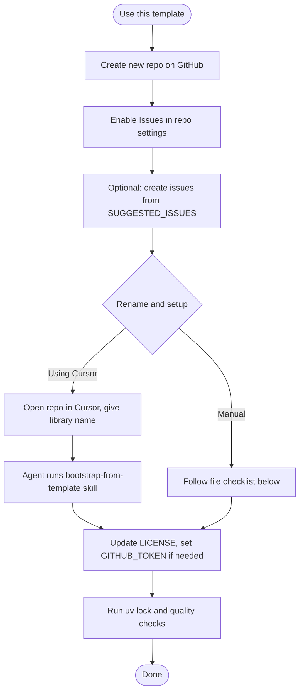

# Bootstrap new library from this template

When you create a new repository from this template, you can either rename and update everything manually (see **TEMPLATE.md** in the repository root) or use the **bootstrap-from-template** skill so an agent does it in one pass.

## Workflow

## Using the skill (Cursor)

1. Create a new repo from this template (GitHub **Use this template**).
2. Clone the new repo and open it in Cursor.
3. Tell the agent you are setting up a new library from this template and provide:
   - **Required**: New library name (e.g. `my-auth-lib`, `My Auth Library`).
   - **Optional**: One-line description, author/copyright holder, GitHub repo URL (`org/repo` or full URL).
4. The agent will run the **bootstrap-from-template** skill: rename project and package everywhere, update metadata, run `uv lock`, and suggest a commit.

## Full file checklist (for manual or agent use)

Replace:

- `kalvi_library_template` → **package_name** (import-style, underscores)
- `kalvi-library-template` → **project_name** (PyPI-style, hyphens)

Rename:

- `src/kalvi_library_template/` → `src/<package_name>/`
- `docs/api/kalvi_library_template.md` → `docs/api/<package_name>.md`

Update content in:

| File | What to change |
|------|----------------|
| `pyproject.toml` | `name`, `packages`, `known-first-party`, `version_files`, `[tool.coverage.run]` source |
| `docs/api/<package_name>.md` | Title and `::: <package_name>` |
| `docs/index.md` | Title, API link, README link (if repo known) |
| `docs/testing.md` | Import and coverage path |
| `mkdocs.yml` | `site_name`, `site_url`, nav API entry |
| `README.md` | Title, description, all paths and package refs |
| `TEMPLATE.md` | Step 4: replace with "Already done if you used the bootstrap-from-template skill" or a short note that the repo was created from the template |
| `AGENTS.md` | Package path and all command examples |
| `CONTRIBUTING.md` | Coverage path |
| `CHANGELOG.md` | Compare/tag URLs (if repo known) |
| `SECURITY.md` | Repo path in advisory link |
| `LICENSE` | Copyright holder and year |
| `noxfile.py` | pylint, mypy, coverage, bandit paths |
| `.github/workflows/ci.yml` | coverage, pylint, mypy, bandit paths |
| `.cursor/skills/release/SKILL.md` | Path to `__init__.py` |
| `.cursor/skills/run-quality-checks/SKILL.md` | All tool paths |
| `.cursor/skills/refactor/SKILL.md` | Package path and first-party name |
| `.cursor/skills/test/SKILL.md` | Package path |
| `.cursor/skills/docs/SKILL.md` | Package path |
| `.cursor/skills/implement-from-issue/SKILL.md` | Package path |
| `.cursor/rules/implementation.mdc` | Package path and first-party |
| `.cursor/rules/python.mdc` | known-first-party |
| `.cursor/commands/run-quality-checks.md` | pylint/mypy paths |
| `.vscode/tasks.json` | pylint and mypy commands |
| `examples/hello.py` | Import and message |
| `tests/test_example.py` | Import |
| `tests/__init__.py` | Comment |

After edits: run `uv lock`, then `uv run pytest` and `uv run ruff check src tests scripts` (or `uv run nox`) to verify.
